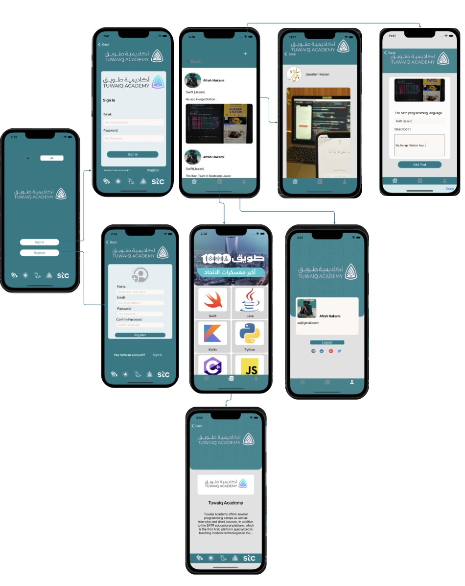

# tuwaiq-academy-app

## Description

The idea of the application for Tuwaiq Academy and trainee can share their projects in bootcamp in the app

## Demo

## user Stories

- As a user and trainee can share their projects in bootcamp in the app
- As a user can select the Programming Language
- As a user update , delete post project 
-  Aa a user I can register 
- As a user I can login 
- As a user I can login out 

## Framework
- UIKit
- Firebase
- Foundation
- IQKeyboardManagerSwift

## ERD

## Wireframe

